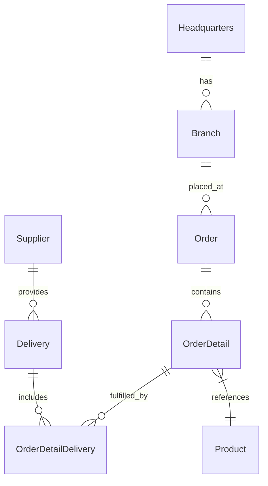

# Reducing Developer Toil — GitHub Copilot Workshop


> **Turn hours of repetitive work into minutes of AI-assisted flow.**

A hands-on workshop where enterprise developers tackle real developer toils using the latest GitHub Copilot features — Coding Agent, Agent Mode, Code Review, MCP Servers, Custom Instructions, Skills, Custom Agents, and more.

---

## Prerequisites

| Requirement | Details |
|------------|---------|
| **GitHub account** | With **Copilot Enterprise** or **Copilot Business** license |
| **VS Code** | Latest version with [GitHub Copilot](https://marketplace.visualstudio.com/items?itemName=GitHub.copilot) + [Copilot Chat](https://marketplace.visualstudio.com/items?itemName=GitHub.copilot-chat) extensions |
| **Node.js** | v24+ (`node --version`) |
| **npm** | v10+ (`npm --version`) |
| **Git** | Configured with your GitHub credentials |
| **GitHub PAT** | Required for MCP server labs ([create one](https://github.com/settings/tokens)) |

### Org Settings Required

| Feature | Setting Location |
|---------|-----------------|
| Copilot Coding Agent | Org → Copilot → Policies → Coding Agent: **Enabled** |
| Copilot Code Review | Org → Copilot → Policies → Code Review: **Enabled** |
| GitHub Advanced Security | Repo → Settings → Security → Code scanning: **Enabled** *(optional — only required for [Lab 07](workshop/labs/lab-07-security-autofix/README.md))* |

---

## Quick Start (5 min)

### 1. Create Your Repo from the Template

1. Click the green **"Use this template"** button at the top of this repository (or go to **Code → Use this template → Create a new repository**).
2. Select your **own account or org** as the owner.
3. Give the repo a name (e.g., `copilot-workshop`) and set it to **Public** or **Private**.
4. Click **Create repository**.
5. Clone your new repo:

```bash
git clone https://github.com/<your-username>/<your-repo-name>.git
cd <your-repo-name>
```

> **Why a template?** Each attendee gets their own repo with full push access — required for Coding Agent PRs, Code Review, and GitHub Advanced Security labs.

### 2. Install

```bash
cd api && npm install && cd ..
cd frontend && npm install && cd ..
```

### 3. Run

Open two terminals:

```bash
# Terminal 1 — API
cd api
npm run dev
```

```bash
# Terminal 2 — Frontend
cd frontend
npm run dev
```

### 4. Verify

| Service | URL | What you should see |
|---------|-----|-------------------|
| API | http://localhost:3000/api-docs | Swagger UI |
| Frontend | http://localhost:5173 | React app with products, orders, etc. |

---

## The Application

**OctoCAT Supply** is a supply chain management system built with a modern TypeScript stack. You'll use it throughout every lab.

```
Frontend (React + Vite + Tailwind)  →  API (Express.js + TypeScript)  →  SQLite
```



---

## Labs

> **Pick the toils that hurt your team most, or crush them all.**
>
> Each lab is **standalone** (no dependencies between labs). Times show **core exercises → all exercises**.

### Backlog Cleanup & Boilerplate

| Lab | Title | Toil Solved | Copilot Feature | Time |
|-----|-------|-------------|----------------|------|
| [01](workshop/labs/lab-01-coding-agent/README.md) | **Zero to PR** | Translating issues to code | Coding Agent | 15–50 min |
| [02](workshop/labs/lab-02-agent-mode/README.md) | **Feature Build** | Scaffolding components | Agent Mode | 30–55 min |
| [09](workshop/labs/lab-09-github-skills/README.md) | **Teach Copilot Your Patterns** | Repeating entity patterns | Copilot Skills | 30–55 min |

### Code Hygiene & Standards

| Lab | Title | Toil Solved | Copilot Feature | Time |
|-----|-------|-------------|----------------|------|
| [03](workshop/labs/lab-03-code-review/README.md) | **AI First-Pass Review** | PR review bottleneck | Code Review + Custom Agent | 20–55 min |
| [05](workshop/labs/lab-05-custom-instructions/README.md) | **Team Standards as Code** | Manual standards enforcement | Custom Instructions | 25–55 min |
| [08](workshop/labs/lab-08-documentation/README.md) | **Self-Documenting Code** | Writing documentation | Agent Mode + Doc Agent | 20–55 min |
| [10](workshop/labs/lab-10-custom-agents/README.md) | **Build Your Own Agent** | Specialized workflows | Custom Agents | 15–50 min |

### Testing & Quality

| Lab | Title | Toil Solved | Copilot Feature | Time |
|-----|-------|-------------|----------------|------|
| [06](workshop/labs/lab-06-parallel-delegation/README.md) | **Agent HQ: Batch It** | Sequential small tasks | Parallel Agents + Agent HQ | 15–50 min |
| [07](workshop/labs/lab-07-security-autofix/README.md) | **Zero-Day to Zero-Effort** | Fixing vulnerabilities | Security Autofix + Agent | 20–50 min |

### Tools & Integration

| Lab | Title | Toil Solved | Copilot Feature | Time |
|-----|-------|-------------|----------------|------|
| [04](workshop/labs/lab-04-mcp-servers/README.md) | **Connect Your Tools** | Context switching | MCP Servers | 20–60 min |

---

## Toil Scorecard

Each lab includes a **Toil Scorecard** — estimate your before/after as you go:

| Metric | Without Copilot (est.) | With Copilot (est.) | Savings |
|--------|----------------------|-------------------|---------|
| Time to complete | ___ min | ___ min | ___% |
| Lines coded manually | ___ | ___ | ___% |
| Context switches | ___ | ___ | ___% |
| Errors/rework cycles | ___ | ___ | ___% |

> **At the end of the workshop**, calculate your total: hours saved × 50 weeks × team size = **annual hours reclaimed**.

---

## Agents & Skills Created During Labs

By the end of the workshop, you'll have created these reusable assets:

| Asset | Type | Created In |
|-------|------|-----------|
| Code Reviewer | Agent | Lab 03 |
| Project Status | Agent | Lab 04 |
| Security Reviewer | Agent | Lab 07 |
| Doc Generator | Agent | Lab 08 |
| Codebase Navigator | Agent | Lab 10 |
| PR Review Pipeline | Agent | Lab 10 |
| Frontend Component | Skill | Lab 09 |

---

## Useful Commands

| Task | Command |
|------|--------|
| Install all deps | `cd api && npm install && cd ../frontend && npm install` |
| Dev mode (API) | `cd api && npm run dev` |
| Dev mode (Frontend) | `cd frontend && npm run dev` |
| Run all tests | `cd api && npm test && cd ../frontend && npm test` |
| Build both projects | `cd api && npm run build && cd ../frontend && npm run build` |
| Lint both projects | `cd api && npm run lint && cd ../frontend && npm run lint` |
| Reset database | `cd api && npm run db:migrate && npm run db:seed` |
| Clean artifacts | Delete `node_modules/` and `dist/` in `api/` and `frontend/` |

---

## Reference

| Resource | Description |
|----------|-------------|
| [Architecture](./docs/architecture.md) | Detailed system design |
| [SQLite Integration](./docs/sqlite-integration.md) | Database patterns and config |

---

## Troubleshooting

| Problem | Fix |
|---------|-----|
| Port 3000 / 5173 in use | `npx kill-port 3000 5173` |
| npm install fails | Delete `node_modules` in `api/` and `frontend/`, re-run install |
| Copilot not responding | Check the Copilot extension is signed in and enabled |
| MCP servers not loading | Restart VS Code, check `.vscode/mcp.json` config |
| Coding Agent not available | Verify org policy enables Coding Agent |
| CodeQL not running | Enable GitHub Advanced Security in repo settings *(only needed for Lab 07)* |

---

*Built with GitHub Copilot.*
