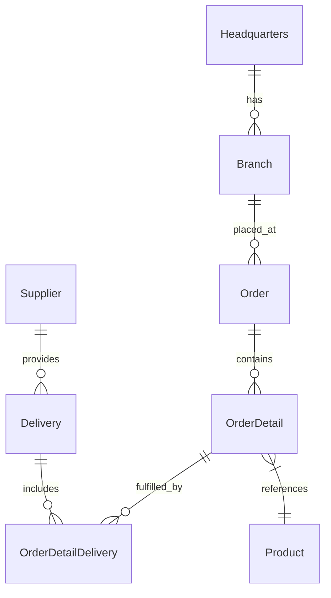

# Reducing Developer Toil — GitHub Copilot Workshop


A hands-on workshop where developers tackle real developer toils using the latest GitHub Copilot features — Coding Agent, Agent Mode, Code Review, MCP Servers, Custom Instructions, Skills, and Custom Agents.

> **Start here** → [Workshop Labs & Instructions](./workshop/README.md)

---

## Prerequisites

| Requirement | Details |
|------------|---------|
| **GitHub account** | With Copilot Enterprise or Copilot Business license |
| **VS Code** | Latest version with [GitHub Copilot](https://marketplace.visualstudio.com/items?itemName=GitHub.copilot) + [Copilot Chat](https://marketplace.visualstudio.com/items?itemName=GitHub.copilot-chat) extensions |
| **Node.js** | v24+ (`node --version`) |
| **npm** | v10+ (`npm --version`) |
| **Git** | Configured with your GitHub credentials |
| **GitHub PAT** | Required for MCP server labs ([create one](https://github.com/settings/tokens)) |

---

## Quick Start

### 1. Clone

```bash
git clone <your-repo-url>
cd <repo-name>
```

### 2. Install & run

**With Make:**

```bash
make install   # Install all dependencies
make dev       # Start API + Frontend
```

**Without Make:**

```powershell
# Install
cd api; npm install; cd ..
cd frontend; npm install; cd ..

# Start API (Terminal 1)
cd api; npm run dev

# Start Frontend (Terminal 2)
cd frontend; npm run dev
```

### 3. Verify

| Service | URL | What you should see |
|---------|-----|-------------------|
| API | http://localhost:3000/api-docs | Swagger UI |
| Frontend | http://localhost:5173 | React app with products, orders, etc. |

---

## The Application

**OctoCAT Supply** is a supply chain management system built with a modern TypeScript stack. You'll use it throughout every lab.

```
Frontend (React + Vite + Tailwind)  →  API (Express.js + TypeScript)  →  SQLite
```



---

## Useful Commands

| Task | Make | Without Make |
|------|------|-------------|
| Install deps | `make install` | `cd api && npm install && cd ../frontend && npm install` |
| Start dev servers | `make dev` | Start API + Frontend in separate terminals (see above) |
| Run all tests | `make test` | `cd api && npm test && cd ../frontend && npm test` |
| Build for production | `make build` | `cd api && npm run build && cd ../frontend && npm run build` |
| Reset database | `make db-init` | `cd api && npm run db:migrate && npm run db:seed` |
| See all commands | `make help` | — |

---

## Workshop Content

| Resource | Description |
|----------|-------------|
| [Workshop Labs](./workshop/README.md) | 10 hands-on labs — start here |
| [Facilitator Guide](./workshop/FACILITATOR-GUIDE.md) | Delivery tips, timing, troubleshooting |
| [Architecture](./docs/architecture.md) | Detailed system design |
| [SQLite Integration](./docs/sqlite-integration.md) | Database patterns and config |

---

## Troubleshooting

| Problem | Fix |
|---------|-----|
| `make` not found | Use the "Without Make" commands above, or install Make |
| Port 3000 / 5173 in use | `npx kill-port 3000 5173` |
| npm install fails | Delete `node_modules` in `api/` and `frontend/`, re-run install |
| Copilot not responding | Check the Copilot extension is signed in and enabled |
| MCP servers not loading | Restart VS Code, check `.vscode/mcp.json` config |

---

*Built with GitHub Copilot.*
